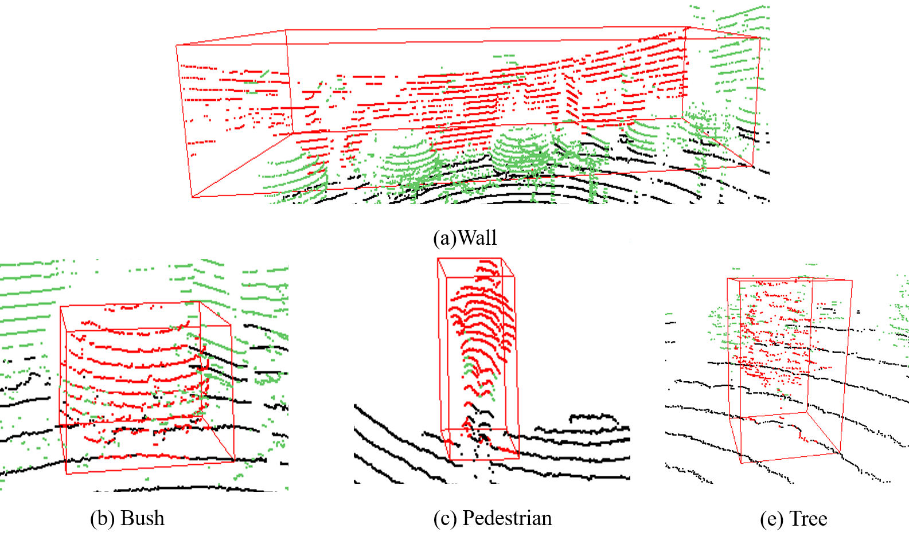

# LiDARNet (LSOOD)

This dataset is collected by an HDL-32E Velodyne LiDAR sensor carried by our UGV platform. Raw point clouds collected from a real outdoor scene are segmented into individual obstacles according to a fast spatial clustering method [1]. We developed a semi-automatic 3D object labeling tool to store individual object point clouds [2]. The UGV and a semi-automatic 3D object labeling tool are presented in the following figure. 

&nbsp;

    

&nbsp;

    

&nbsp;

**We collected 1056 obstacles from several thousands of scanning frames, containing 4 kinds of common types. All the point coordinates are stored in .csv files with their original and after-centralized x, y, z coordinates.**

&nbsp;

    

&nbsp;

## LiDAR:
### Train&Testing sample statistic

|       | Building | Bush | Pedestrian | Tree | Total |
| :---: | :---:    |:---: |      :---: |:---: | :---: |
| Train | 180 | 110 | 50 | 190 | 530 |
| Test  | 155 | 113 | 33 | 225 | 526 |
| Total | 335 | 223 | 83 | 415 | 1056 |

&nbsp;
## Citation
### If you find our work useful in your research, please consider citing:

1.	Y Tian, W Song, L Chen, et al., A Fast Spatial Clustering Method for Sparse LiDAR Point Clouds Using GPU Programming, Sensors 20 (8), 2309
2.	W Song, L Zhang, Y Tian, et al., CNN-based 3D object classification using Hough space of LiDAR point clouds, Human-centric Computing and Information Sciences 10 (1), 1-14

&nbsp;
## Principal Investigator
Song Wei (sw@ncut.edu.cn); Tian Yifei (yb87403@um.edu.mo, tianyifei0000@sina.com) 

&nbsp;
## Project Researchers
Zhang Lifeng; Liu Zishu
