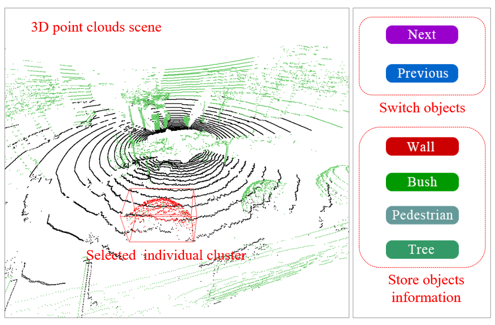

# LiDARNet v2

This dataset is collected by an HDL-32E Velodyne LiDAR sensor carried by our UGV platform. Raw point clouds collected from a real outdoor scene are segmented into individual obstacles according to a fast spatial clustering method [1]. We developed a semi-automatic 3D object labeling tool to store individual object point clouds [2]. The UGV and a semi-automatic 3D object labeling tool are presented in the following figure. 

&nbsp;

    

&nbsp;

    

&nbsp;

**We collected 1056 obstacles from several thousands of scanning frames, containing 4 kinds of common types. All the point coordinates are stored in .csv files with their original and after-centralized x, y, z coordinates.**

&nbsp;

    

&nbsp;

## LiDAR:
### Train&Testing sample statistic

|       | Building | Bush | Car | Pedestrian | Tree | Pole | Total |
| :---: | :---:    |:---: |      :---: |:---: | :---: | :---: | :---: |
| Total | 769 | 246 | 93 | 111 | 1147 | 274 | 2640 |

&nbsp;
## Citation
### If you find our work useful in your research, please consider citing:

1.	Tian, Yifei; Chen, Long; Song, Wei*; Sung, Yunsick; Woo, Sangchul, DGCB-Net: Dynamic Graph Convolutional Broad Network for 3D Object Recognition in Point Cloud, Remote Sensing, Vol.13, No.1, 66, eISSN: 2072-4292, 2020.12.26
2.	Zishu Liu, Wei Song*, Yifei Tian, Sumi Ji, Yunsick Sung, Long Wen, Tao Zhang, Liangliang Song, Amanda Gozho, VB-Net: Voxel-Based Broad Learning Network for 3D Object Classification, Applied Science, Vol.10, No.19, 6735, 2020.9.26
3.	Wei Song*, LingFeng Zhang, Yifei Tian, Simon Fong, Jinming Liu, Amanda Gozho, CNN-based 3D Object Classification Using Hough Space of LiDAR Point Clouds, Human-centric Computing and Information Sciences, Vol.10, No.1, 2020.5.7
4.	Yifei Tian, Wei Song*, Long Chen, Yunsick Sung, Jeonghoon Kwak, Su Sun, A Fast Spatial Clustering Method for Sparse LiDAR Point Clouds Using GPU Programming, Sensors, Vol.20, No.8, 2309, 2020.4.

&nbsp;
## Principal Investigator
Song Wei (sw@ncut.edu.cn); Tian Yifei (yb87403@um.edu.mo, tianyifei0000@sina.com) 

&nbsp;
## Project Researchers
Zhang Lifeng; Liu Zishu
